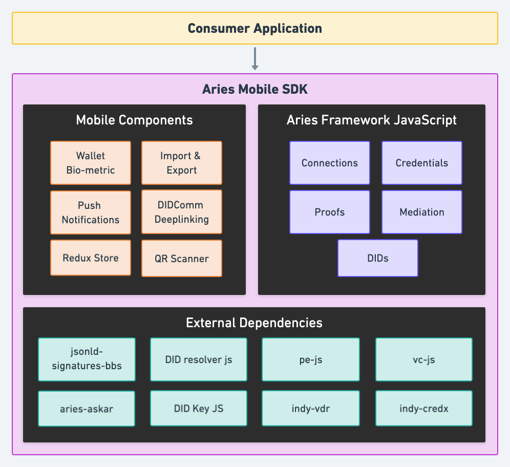

# Functional specification of Aries Mobile SDK component

## Table of contents

- [Table of contents](#table-of-contents)
- [Context](#context)
- [Mobile SDK](#mobile-sdk)
- [Functionalities](#functionalities)
- [Aries Feature Overview](#aries-feature-overview)
- [Mobile SSI Stack](#mobile-ssi-stack)

## Context

The Aries Mobile SDK is a complete toolkit for cross-platform iOS and Android SSI application development using React Native. With this SDK, developers can build mobile SSI solutions for any use case. The SDK contains reusable issuer, holder and verifier components as well as essential components for mobile development (e.g. deep linking, state management and biometric wallet unlocking). Developers can either start from scratch or integrate a selection of components into their existing mobile app. The Aries Mobile SDK is credential format and DID method agnostic, and uses the latest open standards to break out of the Indy & Aries ecosystem (e.g. W3C VCs, DIF PE, BBS+ Signatures).

The Aries Mobile SDK is 100% open-source, focuses on interoperability and open standards and is accessible for developers of any skill level. It aims to drastically lower the barrier of mobile SSI development. The usage of TypeScript and availability of type definitions make it easier to integrate with the library.

## Mobile SDK

## Functionalities

The Aries Mobile SDK will (at least) support the following features:

- TypeScript native framework, built for cross-platform mobile development on iOS & Android
- A generic DID resolver interface that support the `did:key`, `did:web` and `did:sov` methods.
- Issuance of Indy credentials using both v1 and v2 of the Issue Credential protocol.
- Proving and verifying of Indy credentials using both v1 and v2 of the Present Proof protocol.
- Issuance of JSON-LD credentials using v2 of the Issue Credential protocol (RFC 0593 for JSON-LD credential exchange).
- Proving and verifying of JSON-LD credentials using DIF Presentation Exchange v1, and Present Proof protocol v2.
- Sign and verify JSON-LD credentials with the `Ed25519Signature2018`, `BbsBlsSignature2020` and `BbsBlsSignatureProof2020` signature suites.
- Fully AIP 1.0 and 2.0 compliant
- Mediation of DIDComm messages to hold messages while the mobile device is offline
  - Allows to use mediator of choice (currently either AFJ or ACA-Py supported).
- Set of ready to use React Native modules needed for every mobile wallet
  - Storage of key to unlock wallet in iOS & Android secure enclave, protected by biometrics or pin code.
  - Set up of push notifications with automatic provisioning of mediator to receive push notifications when messages are received when wallet is closed.
  - QR Scanner component for connection invitation handling.
  - DIDComm deep linking setup so you can open DIDComm links in your wallet.
  - Redux Store wrapper to integrate wallet functionality into a Redux store.
  - Wallet import & export to local device for backups and recovery (may look into protocol for storing and backups at mediator in the future).

## Aries Feature Overview

A detailed overview of which Aries features, agent types, protocols and AIP versions the mobile SDK will support see the [Aries Mobile SDK - Aries Feature Overview](./aries-mobile-sdk-aries-feature-overview.md) document.

## Mobile SSI Stack

Besides the mobile SDK we're building an ecosystem of organizations and governments building mobile wallets on Aries Framework JavaScript and related tools. For more information see the [Mobile SSI Stack](https://hackmd.io/@animo/mobile-ssi-stack) overview document.
