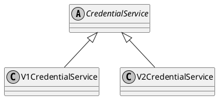

# Issue Credential Implementers Guide

This documents gives an overview of the envisioned architecture for the AIP 2.0 compliant `CredentialsModule`.

## Credential formats

One of the primary features of [issue-credential v2](https://github.com/hyperledger/aries-rfcs/blob/main/features/0453-issue-credential-v2/README.md), is the introduction of new credential formats. In AFJ, we're only looking to add support for JSON-LD credentials for now.

## Current Architecture

## Envisioned Architecture

### Credential formats

One of the main features of `issue-credential v2` is the support for multiple credential formats. Therefore, on top of the already supported Indy credential format, we will add support for JSON-LD credentials in AFJ. However, in order to allow support for other formats to be added later on, we need a mechanism to do so.

<!-- TODO -->

### Credential services

In order to add support for `issue-credential v2`, changes to the `CredentialService` class have to be made. The following structure is a possible approach:

#### CredentialService

The _abstract_ `CredentialService` class is where overlapping functionality of `v1` and `v2` is implemented. This is mainly functionality related to the **indy credential format**.

#### CredentialServiceV1

This is where all `v1` specific functionality is implemented.

#### CredentialServiceV2

This is where all `v2` specific functionality is implemented. This service also needs a **mechanism** to add support for other formats later on.

<!-- Service versions = mapping -->
<!-- TODO CredentialRecord  -->
<!-- TODO Credential  -->
